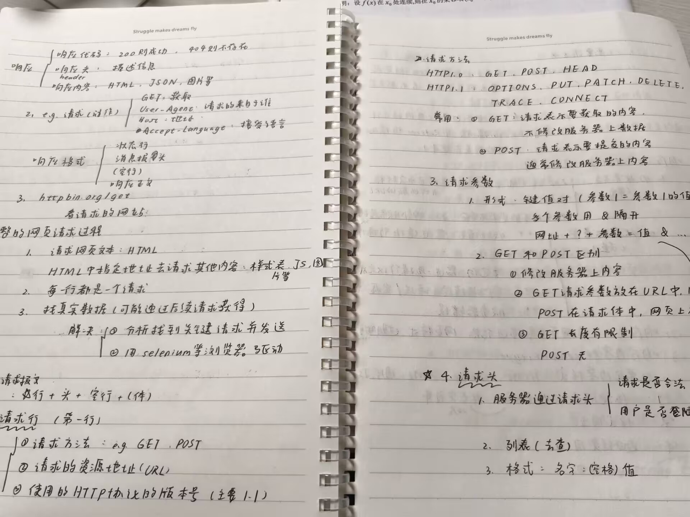
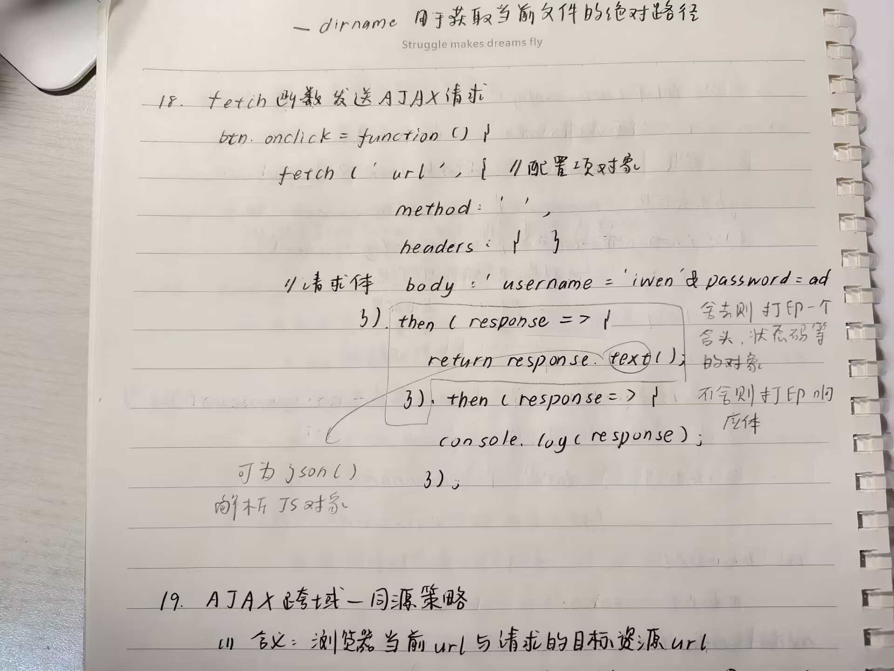
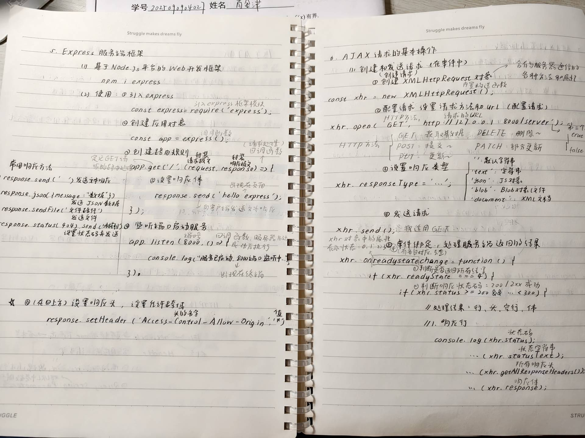
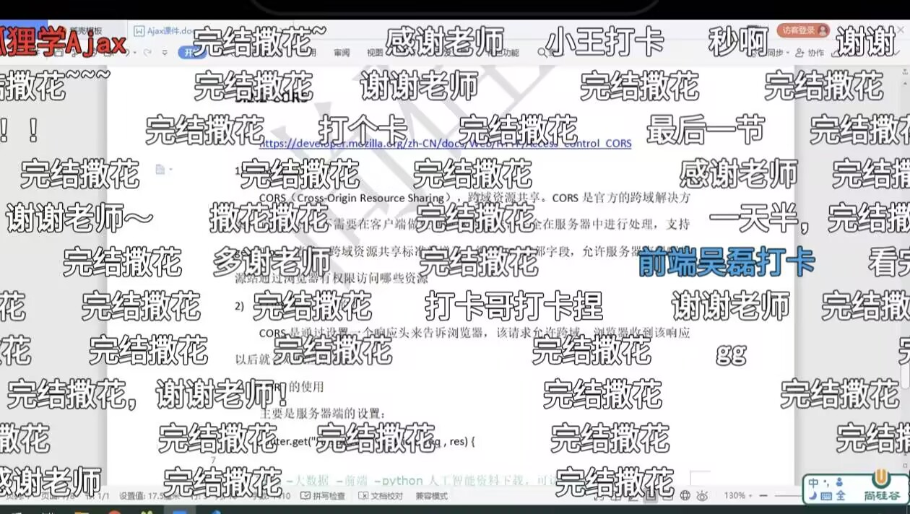
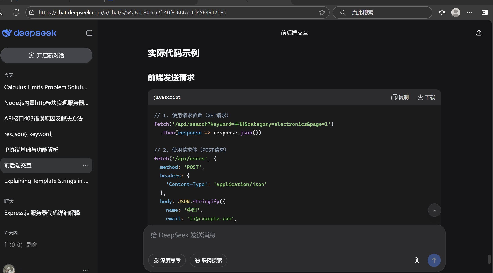
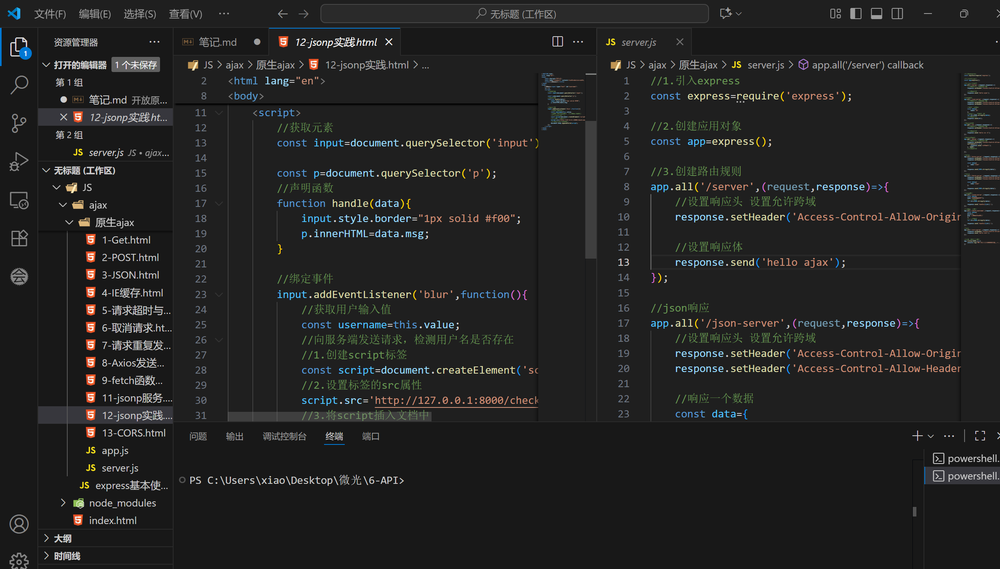
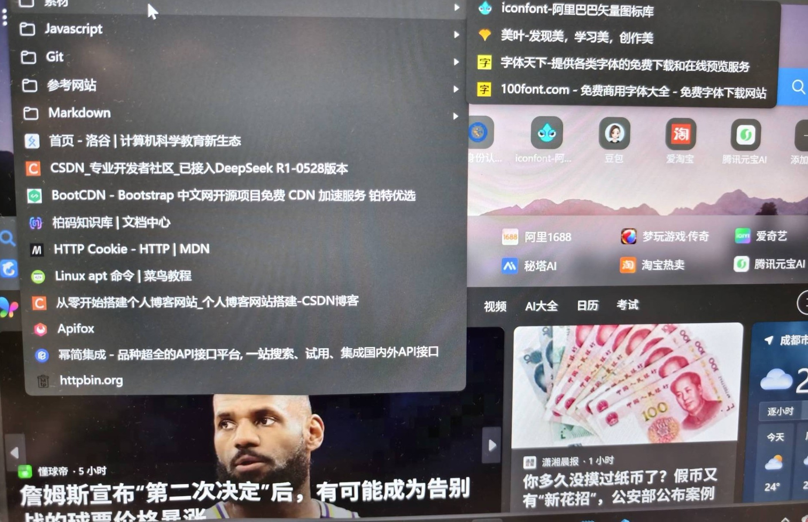

## 第2、3题笔记and心路历程
因为喜欢手写笔记，所以就拍了几张放进来，这里主要写感受
***
#### 1.学习http协议
听说尚硅谷那个网课比较难，所以想提前了解一下，事实证明这很正确，耗时两节思想道德与法治，过程比较顺利大概是网课选的还可以，并且这也就做个了解，还没用，不知道后面有多难受。

#### 2.学习Ajax
通过一条三人链条阴差阳错获得了尚硅谷网课的推荐（十分感谢！），国庆快开始的时候点开的，看着只有三个多小时，但我配那个可恶的环境就用了一天。  

跟着写代码的时候感觉好神奇，好像走进了网络世界，在揭开一些以前不理解也不在意的东西，像之前我愿称之为乱码的参数，不会停留一秒的开发者工具，服务器什么的概念等等。

#### 3.看题做题
虽然跟着网课把代码打了一遍，但实际用的时候还是比较卡顿，幸好有笔记。第一次回来看题时其实是很蒙的，不懂怎么就跨越到api了，开头很痛苦。于是在B站和csdn上面搜索一通，其实还是没找到清晰一点的讲解，最后大概是浏览东西过多加上一直在动脑，似乎是悟出来了api怎么用了。  

哈回来一看还是很蒙，我不知道这题是要我去搞一个api还是直接JavaScript模拟一下就好，这很难过了，遂去找免费api，但好像很少有搞这么简单的的，然后我找到的放在apifox上面都在报错T-T。反正一通乱搞最后是交上来这个样子,我没辙了至少是能完成任务了。~~很烦很烦很烦~~

#### 4.自我介绍网页
虽然搞了一天有点累，颈椎已经开始罢工，但过程还是很享受的。无论是选背景、找字体还是配色都很好玩，喜欢这种挑选过程。因为确实很多网课的高级部分还没看完，所以中间去现学了一点想搞的效果，弄出来真的很有成就感。然后就是其实还没学flex布局，但是过程中发现它如此重要就去浅浅了解了一下，后面空了会去专门学的。

#### 5.最后困惑
还是那个表单的问题，想问这种方法可以吗，我感觉大概率不是题目要求的但我暂时没脑子去想了。怪不方便的每次打开都要启动那个服务器（？），每次刷新页面还要再登录一遍。。。真的很烦人了，所以没有做第二题直接并在第三题里了。